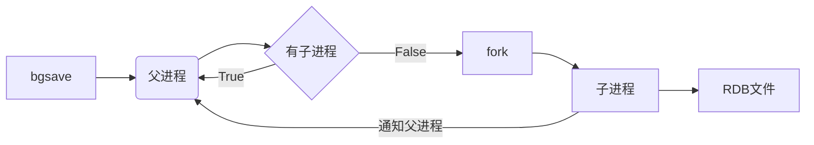
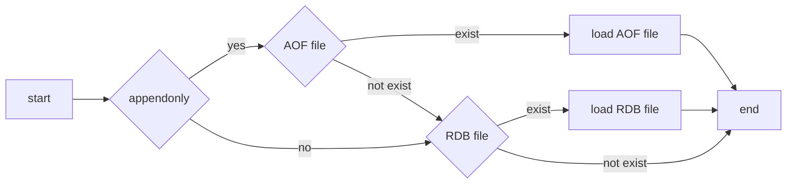

# Redis

# Introduction

## Feature

- open source (BSD)
- written in c language
- data structure store
- key value pairs in memory 
- 10w ops / single node
- standalone, master / slave, cluster

## Use Case

- cache
- database


# Install

- home https://redis.io/
- github https://github.com/antirez/redis  41.6k stars
- mirror http://www.redis.cn/

## compile

```
sudo yum install -y gcc make

curl -O http://download.redis.io/releases/redis-5.0.8.tar.gz
tar xvf redis-5.0.8.tar.gz
cd redis-5.0.8
make
```
## install
```
make install   ## copy cmd  /usr/local/bin/

redis-server
redis-cli
redis-sentinel
redis-check-aof
redis-check-rdb
redis-benchmark
```
## start
```
vi redis.conf

#bind 127.0.0.1
port 6379
daemonize no
#requirepass yourpassword

redis-server redis.conf
```

## hello world

```
redis-cli 
redis-cli -h ip -p port -a password

>set hello world
>get hello
```


# Data Structure

|        |          |      |      |
| ------ | -------- | ---- | ---- |
|        | encoding |      |      |
| string |          |      |      |
| list   |          |      |      |
| hash   |          |      |      |
| set    |          |      |      |
| zset   |          |      |      |
|        |          |      |      |


# Command

## string
|Command|O|Version|Note|
|:--|---|--|---|
|APPEND key value|~O(1)|2.0.0||
|GET key|O(1)|1.0.0||
|GETRANGE key start end|O(N)|2.4.0|<2.0 SUBSTR|
|GETSET key value|O(1)|1.0.0||
|MGET k1 [k2 ...]|O(N)|1.0.0||
|MSET k1 v1 [k2 v2 ...]|O(N)|1.0.1||
|MSETNX k1 v1 [k2 v2 ...]|O(N)|1.0.1|atomic|
|PSETEX key milliseconds value|O(1)|2.6.0||
|<font color="blue">SET key value [EX seconds] [PX milliseconds] [NX\|XX]</font>|O(1)|1.0.0|EX\|PX\|NX\|XX 2.6.12|
|SETEX key seconds value|O(1)|2.0.0||
|SETNX key value|O(1)|1.0.0||
|SETRANGE key offset value|O(1)|2.2.0||
|STRLEN key|O(1)|2.2.0||


### number

|Command|O|Version||
|:--|---|--|---|
|DECR key|O(1)|1.0.0||
|DECRBY key decrement|O(1)|1.0.0||
|INCR key|O(1)|1.0.0||
|INCRBY key increment|O(1)|1.0.0||
|INCRBYFLOAT key increment|O(1)|2.6.0||


### bitmap

|Command|O|Version||
|:--|---|--|---|
|BITCOUNT key [start end]|O(N)|2.6.0||
|BITOP NOT destkey srckey|O(1)|2.6.0||
|BITOP AND destkey sk1 sk2 ... skn | O(N) | 2.6.0 |  |
|BITOP OR   destkey sk1 sk2 ... skn | O(N) | 2.6.0 |  |
|BITOP XOR destkey sk1 sk2 ... skn | O(N) | 2.6.0 |  |
|BITPOS key bit [start] [end] | O(N) | 2.8.7 |  |
|GETBIT key offset | O(1) | 2.2.0 | |
|SETBIT key offset value | O(1) | 2.2.0 | |


### hyperloglog


|Command|O|Version||
|:--|---|--|---|
|PFADD key v1 [v2 ...]|~O(1)|2.8.9||
|PFCOUNT k1 [k2 ...]|~O(1)|2.8.9||
|PFMERGE destkey sk1 [sk2 ...]|O(N)|2.8.9||


## list

|Command|O|Version|Note|
|:--|---|--|---|
|BRPOP k1 [k2 ...] timeout|O(1)|2.0.0||
|BRPOPLPUSH src dest timeout|O(1)|2.2.0||
|BLPOP k1 [k2 ...] timeout|O(1)|2.0.0||
|LINDEX key index|O(N)|1.0.0||
|LINSERT key BEFORE\|AFTER pivot value|O(N)|2.2.0||
|LLEN key|O(1)|1.0.0||
|LPOP key|O(1)|1.0.0||
|LPUSH key v1 [v2 ...]|~O(1)|1.0.0|<2.4 one value|
|LPUSHX key value|O(1)|2.2.0||
|LRANGE key start stop|O(N)|1.0.0||
|LREM key count value|O(N)|1.0.0||
|LSET key index value|O(N)|1.0.0||
|LTRIM key start stop|O(N)|1.0.0||
|RPOP key|O(1)|1.0.0||
|RPOPLPUSH source destination|O(1)|1.2.0||
|RPUSH key v1 [v2 ...]|O(1)|1.0.0||
|RPUSHX key value|O(1)|2.2.0||
|||||


## hash
|Command|O|Version|Note||
|:--|---|--|---|---|
|HDEL key field [field ...]|O(N)|2.0.0|<2.4 single value||
|HEXISTS key field|O(1)|2.0.0|||
|HGET key field|O(1)|2.0.0|||
|HGETALL key|O(N)|2.0.0|||
|HINCRBY key field increment|O(1)|2.0.0|||
|HINCRBYFLOAT key field increment|O(1)|2.6.0|||
|HKEYS key|O(N)|2.0.0|||
|HLEN key|O(1)|2.0.0|||
|HMGET key field [field ...]|O(N)|2.0.0|||
|HMSET key field value [field value ...]|O(N)|2.0.0|||
|HSET key field value|O(1)|2.0.0|||
|HSETNX key field value|O(1)|2.0.0|||
|HSTRLEN key field|O(1)|3.2.0|||
|HVALS key|O(N)|2.0.0|||
|HSCAN key cursor [MATCH pattern] [COUNT count]|~O(1)|2.8.0|||
||||||


## set

|Command|O|Version||
|:--|---|--|---|
|PFADD key v1 [v2 ...]|~O(1)|2.8.9||


## sorted set
|Command|O|Version||
|:--|---|--|---|
|PFADD key v1 [v2 ...]|~O(1)|2.8.9||


### geo
|Command|O|Version||
|:--|---|--|---|
|PFADD key v1 [v2 ...]|~O(1)|2.8.9||


# Persistence

## RDB (Snapshot in Binary )
- disable
```
save ""
```
- enable (default)
```
save 900  1
save 300  10
save 60   10000
```

```
rdbcompression yes  # LZF
dbfilename dump.rdb
rdb-save-incremental-fsync yes # fsync/32MB
```

- save		#  sync 
- bgsave	# async





info persistence

config get dir

config get rdbcompression

redis-check-rdb 


## AOF (Write Command in Text)


```
appendonly no
appendfilename appendonly.aof

auto-aof-rewrite-percentage 100
auto-aof-rewrite-min-size 64mb

aof-use-rdb-preamble yes

#appendfsync always
appendfsync everysec
#appendfsync no
```

- sync policy
  
  - always : write + fsync
  - everysec : write + fsync / seconds 
- no :  write + fsync / os
  
- rewrite

  big -> small

  - expired key

  - set k1 v1 , set k1 v2  等对一个key做多次操作，只保留最后一条命令

  - lpush list a,   lpush list b,   lpush list c 等 合并成一条命令 lpush list a b c

- bgrewriteaof

- auto-aof-rewrite-percentage 100

- auto-aof-rewrite-min-size 64mb


## RDB v.s. AOF


||rdb|aof|rdb + aof|
| ---  | ---  | ---  | ---  |
|操作|全量数据快照|增量追加写命令|先快照再增量|
| 频度 | save 60 10000<br>默认一分钟修改一万次以上快照一次 | 默认每秒写一次盘，推荐 | bgrewriteaof |
| 文件 | 压缩，二进制文件小，加载快 | 文本文件大，需要rewrite，加载慢 |  |
| 故障 | 可能丢失数据多 | 可能丢失数据少 |  |

rdb+aof 二者兼得

 


## RESTART - load data




# Master - Slave

- replicaof ip port / slaveof ip port

- partial resynchronization
```sequence
participant Master
participant Slave

Slave -> Master: replicaof
Master -> Slave:
Slave -> Master: ping
Master -> Slave: pong
Slave -> Master: psync runid offset
Master -> Master: runid != itself or offset not in repl-queue, goto full sync
Master -> Master: runid == itself && offset in repl-queue, continue
Master -> Slave: send command in repl-queue
Master -> Slave: ...  
Master -> Slave: send command in repl-queue
```

- full sync
```sequence
participant Master
participant Slave

Slave -> Master: replicaof
Master -> Slave:
Master --> Master: bgsave -> RDB
Master -> Master: execute command & store write command in repl-queue
Master -> Master: ...
Master -> Slave: send RDB
Master -> Master: execute command & store write command in repl-queue
Master -> Master: ...
Slave -> Slave: load RDB
Master -> Slave: send command in repl-queue  
Master -> Slave: ...  
Master -> Slave: send command in repl-queue
```

```
masterauth master-password

#复制中断或正在进行
#yes - 响应客户端请求，可能返回旧数据
# no - 对应客户端的数据请求返回"SYNC with master in progress"，
#      正常处理info, ping,shutdown等请求 
replica-serve-stale-data yes

replica-read-only yes

replica-priority 100
repl-backlog-size 1mb

#主节点，如果超过3600秒没有slave，释放repl-backlog
#从节点，忽略此项设置，随时可能升级为主节点，然后立刻支持部分复制 
repl-backlog-ttl 3600 

# min-replicas-to-write 0
# min-replicas-max-lag 10
```


 


# Sentinel


sentinel  masters

sentinel  master  master-name

sentinel  slaves  master-name

sentinel  sentinels  master-name

sentinel  get-master-addr-by-name  master-name

sentinel  reset  pattern

sentinel  failover  master-name

sentinel  ckquorum  master-name

sentinel  flushconfig

sentinel  remove  master-name


# Cluster


# Case Study

| 缓存 |           流量特点            |  cache   |  database  | 解决方案                |
| ---- | :---------------------------: | :------: | :--------: | ----------------------- |
| 穿透 | 大流量访问少数key<br>如恶意攻击 |    无    | 无数据 | 1.先鉴权后访问，拦截非法访问<br>2.检查key是否合法，范围检查，布隆过滤器等<br>3. 缓存空值，并短期有效<br> |
| 击穿 | 大流量访问少数key<br>如爆款产品 |    无    |  有数据  | 1.热key不过期<br>2.加锁，请求相同的key互斥<br> |
| 雪崩 |       大流量访问多个key       | 集中失效 |  有数据  | 1.过期时间+随机数，避免集中失效<br>2.使用缓存集群，分散热点key<br>3.热key不过期 |


# Optimize

slowlog  get  n

info commandstats


redis-cli --bigkeys

redis-cli --stat


Transparent Huge Pages

TCP backlog


