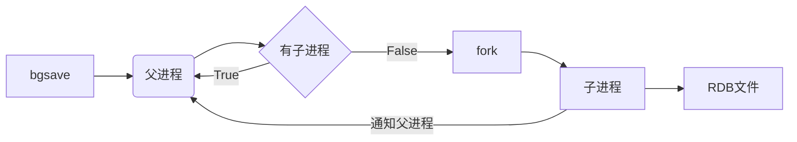
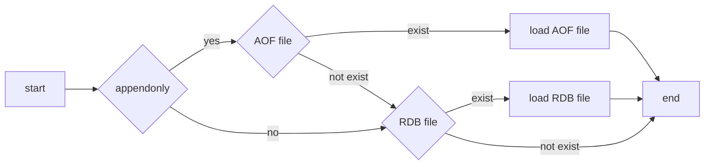

# Redis

# Introduction

## Feature

- open source (BSD)
- written in c language
- key-value pairs in memory 
- data structure store
- 10w ops on single node
- standalone, master / slave, sentinel and cluster

## Use Case

- cache
- database


# Install

- home https://redis.io/
- github https://github.com/antirez/redis  41.6k stars
- mirror http://www.redis.cn/

## compile

```
sudo yum install -y gcc make

curl -O http://download.redis.io/releases/redis-5.0.8.tar.gz
tar xvf redis-5.0.8.tar.gz
cd redis-5.0.8
make
```
## install
```
make install   ## copy cmd to /usr/local/bin/

redis-server
redis-cli
redis-sentinel
redis-check-aof
redis-check-rdb
redis-benchmark
```
## start
```
vi redis.conf

#bind 127.0.0.1
port 6379
daemonize no
#requirepass yourpassword

redis-server redis.conf
```

## hello world

```
redis-cli 
redis-cli -h ip -p port -a password

>set hello world
>get hello
```


# Data Structure

- type key
- object encoding key

| TYPE   | ENCODING   |      | NOTE |      |
| ------ | ---------- | ---- | ---- | ---- |
| string | int        |      | long |      |
|        | embstr     |      |      |      |
|        | raw        |      |      |      |
| list   | ziplist    |      |      |      |
|        | linkedlist |      |      |      |
| hash   | ziplist    |      |      |      |
|        | ht         |      |      |      |
| set    | intset     |      |      |      |
|        | ht         |      |      |      |
| zset   | ziplist    |      |      |      |
|        | skiplist   |      |      |      |
|        |            |      |      |      |


# Command

## string
|Command|O|Version|Note|
|:--|---|--|---|
|APPEND key value|~O(1)|2.0.0||
|GET key|O(1)|1.0.0||
|GETRANGE key start end|O(N)|2.4.0|<2.0 SUBSTR|
|GETSET key value|O(1)|1.0.0||
|MGET k1 [k2 ...]|O(N)|1.0.0||
|MSET k1 v1 [k2 v2 ...]|O(N)|1.0.1||
|MSETNX k1 v1 [k2 v2 ...]|O(N)|1.0.1|atomic|
|PSETEX key milliseconds value|O(1)|2.6.0||
|<font color="blue">SET key value [EX seconds] [PX milliseconds] [NX\|XX]</font>|O(1)|1.0.0|EX\|PX\|NX\|XX 2.6.12|
|SETEX key seconds value|O(1)|2.0.0||
|SETNX key value|O(1)|1.0.0||
|SETRANGE key offset value|O(1)|2.2.0||
|STRLEN key|O(1)|2.2.0||


### number

|Command|O|Version||
|:--|---|--|---|
|DECR key|O(1)|1.0.0||
|DECRBY key decrement|O(1)|1.0.0||
|INCR key|O(1)|1.0.0||
|INCRBY key increment|O(1)|1.0.0||
|INCRBYFLOAT key increment|O(1)|2.6.0||


### bitmap

|Command|O|Version||
|:--|---|--|---|
|BITCOUNT key [start end]|O(N)|2.6.0||
|BITOP NOT destkey srckey|O(1)|2.6.0||
|BITOP AND destkey sk1 sk2 ... skn | O(N) | 2.6.0 |  |
|BITOP OR   destkey sk1 sk2 ... skn | O(N) | 2.6.0 |  |
|BITOP XOR destkey sk1 sk2 ... skn | O(N) | 2.6.0 |  |
|BITPOS key bit [start] [end] | O(N) | 2.8.7 |  |
|GETBIT key offset | O(1) | 2.2.0 | |
|SETBIT key offset value | O(1) | 2.2.0 | |


### hyperloglog


|Command|O|Version||
|:--|---|--|---|
|PFADD key v1 [v2 ...]|~O(1)|2.8.9||
|PFCOUNT k1 [k2 ...]|~O(1)|2.8.9||
|PFMERGE destkey sk1 [sk2 ...]|O(N)|2.8.9||


## list

|Command|O|Version|Note|
|:--|---|--|---|
|BRPOP k1 [k2 ...] timeout|O(1)|2.0.0||
|BRPOPLPUSH src dest timeout|O(1)|2.2.0||
|BLPOP k1 [k2 ...] timeout|O(1)|2.0.0||
|LINDEX key index|O(N)|1.0.0||
|LINSERT key BEFORE\|AFTER pivot value|O(N)|2.2.0||
|LLEN key|O(1)|1.0.0||
|LPOP key|O(1)|1.0.0||
|LPUSH key v1 [v2 ...]|~O(1)|1.0.0|<2.4 one value|
|LPUSHX key value|O(1)|2.2.0||
|LRANGE key start stop|O(N)|1.0.0||
|LREM key count value|O(N)|1.0.0||
|LSET key index value|O(N)|1.0.0||
|LTRIM key start stop|O(N)|1.0.0||
|RPOP key|O(1)|1.0.0||
|RPOPLPUSH source destination|O(1)|1.2.0||
|RPUSH key v1 [v2 ...]|O(1)|1.0.0||
|RPUSHX key value|O(1)|2.2.0||
|||||


## hash
|Command|O|Version|Note||
|:--|---|--|---|---|
|HDEL key field [field ...]|O(N)|2.0.0|<2.4 single value||
|HEXISTS key field|O(1)|2.0.0|||
|HGET key field|O(1)|2.0.0|||
|HGETALL key|O(N)|2.0.0|||
|HINCRBY key field increment|O(1)|2.0.0|||
|HINCRBYFLOAT key field increment|O(1)|2.6.0|||
|HKEYS key|O(N)|2.0.0|||
|HLEN key|O(1)|2.0.0|||
|HMGET key field [field ...]|O(N)|2.0.0|||
|HMSET key field value [field value ...]|O(N)|2.0.0|||
|HSET key field value|O(1)|2.0.0|||
|HSETNX key field value|O(1)|2.0.0|||
|HSTRLEN key field|O(1)|3.2.0|||
|HVALS key|O(N)|2.0.0|||
|HSCAN key cursor [MATCH pattern] [COUNT count]|~O(1)|2.8.0|||
||||||


## set

|Command|O|Version|Note||
|--|---|--|---|---|
|SADD key member [member ...]|O(N)|1.0.0|<2.4 single value||
|SCARD key|O(1)|1.0.0|||
|SDIFF key [key ...]|O(N)|1.0.0|||
|SDIFFSTORE dest key [key ...]|O(N)|1.0.0|||
|SINTER key [key ...]|O(N*M)|1.0.0|||
|SINTERSTORE dest key [key ...]|O(N*M)|1.0.0|||
|SISMEMBER key member|O(1)|1.0.0|||
|SMEMBERS key|O(N)|1.0.0|||
|SMOVE source destination member|O(1)|1.0.0|||
|SPOP key [coutn]|~O(1)|1.0.0|||
|SRANDMEMBER key [count]|~O(1)|1.0.0|||
|SREM key member [member ...]|O(N)|1.0.0|||
|SUNION key [key ...]|O(N)|1.0.0|||
|SUNIONSTORE destination key [key ...]|O(N)|1.0.0|||
|SSCAN key cursor [MATCH pattern] [COUNT count]|O(1)|2.8.0|||


## sorted set
|Command|O|Version||
|:--|---|--|---|
|ZADD key [NX\|XX] [CH] [INCR] score member [score member ...]|O(log(N))+|1.2.0||
|ZCARD key|O(1)|1.2.0||
|ZCOUNT key min max|O(log(N))|2.0.0||
|ZINCRBY key increment member|O(log(N))|1.2.0||
|ZINTERSTORE dest numkeys key [key ...] [WEIGHTS weight] [SUM\|MIN\|MAX]|O(N*K+M*log(M))|2.0.0||
|ZLEXCOUNT key min max|O(log(N))|2.8.9||
|ZPOPMAX key [count]|O(log(N)*M)|5.0.0||
|ZPOPMIN key [count]|O(log(N)*M)|5.0.0||
|ZRANGE key start stop [WITHSCORES]|O(log(N)+M)|1.2.0||
|ZRANGEBYLEX key min max [LIMIT offset count]|O(log(N)+M)|2.8.9||
|ZREVRANGEBYLEX key max min [LIMIT offset count]|O(log(N)+M)|2.8.9||
|ZRANGEBYSCORE key min max [WITHSCORES] [LIMIT offset count]|O(log(N)+M)|1.0.5||
|ZRANK key member|O(log(N))|2.0.0||
|ZREM key member [member ...]|O(M*log(N))|1.2.0||
|ZREMRANGEBYLEX key min max|O(log(N)+M)|2.8.9||
|ZREMRANGEBYRANK key start stop|O(log(N)+M)|2.0.0||
|ZREMRANGEBYSCORE key min max|O(log(N)+M)|1.2.0||
|ZREVRANGE key start stop [WITHSCORES]|O(log(N)+M)|1.2.0||
|ZREVRANGEBYSCORE key max min [WITHSCORES] [LIMIT offset count]|O(log(N)+M)|2.2.0||
|ZREVRANK key member|O(log(N))|2.0.0||
|ZSCORE key member|O(1)|1.2.0||
|ZUNIONSTORE destination numkeys key [key ...] [WEIGHTS weight] [SUM\|MIN\|MAX]|O(N)+O(M*log(M))|2.0.0||
|ZSCAN key cursor [MATCH pattern] [COUNT count]|O(1)|2.8.0||
|||||


### geo
|Command|O|Version||
|---|---|--|---|
|GEOADD key longitude latitude member [longitude latitude member ...]|O(log(N)*M)|3.2.0||
|GEOHASH key member [member ...]|O(log(N))|3.2.0||
|GEOPOS key member [member ...]|O(log(N))|3.2.0||
|GEODIST key member1 member2 [unit]|O(log(N))|3.2.0||
|GEORADIUS key logitude latitude radius m\|km\|ft\|mi [WITHCOORD] [WITHDIST] [WITHHASH] [COUNT count]|O(N+log(M))|3.2.0||
|GEORADIUSBYMEMBER key member radius m\|km\|ft\|mi [WITHCOORD] [WITHDIST] [WITHHASH] [COUNT count]|O(N+log(M))|3.2.0||
|||||

## cluster

| Command                                                      | O    | Version | Note       |
| ------------------------------------------------------------ | ---- | ------- | ---------- |
| CLUSTER ADDSLOTS slot [slot ...]                             | O(N) | 3.0.0   |            |
| CLUSTER COUNT-FAILURE-REPORTS node-id                        | O(N) | 3.0.0   |            |
| CLUSTER COUNTKEYSINSLOT slot                                 |      |         |            |
| CLUSTER DELSLOTS slot [slot ...]                             |      |         |            |
| CLUSTER FAILOVER [FORCE\|TAKEOVER]                           |      |         |            |
| CLUSTER FORGET node-id                                       |      |         |            |
| CLUSTER GETKEYSINSLOT slot count                             |      |         |            |
| CLUSTER INFO                                                 |      |         |            |
| CLUSTER KEYSLOT key                                          |      |         |            |
| CLUSTER MEET ip port                                         |      |         |            |
| CLUSTER NODES                                                |      |         |            |
| CLUSTER REPLICAS node-id                                     |      |         |            |
| CLUSTER REPLICATE node-id                                    |      |         |            |
| CLUSTER RESET [HARD\|SOFT]                                   |      |         |            |
| CLUSTER SAVECONFIG                                           | O(1) | 3.0.0   | nodes.conf |
| CLUSTER SET-CONFIG-EPOCH config-epoch                        |      |         |            |
| CLUSTER SETSLOT slot IMPORTING\|MIGRATING\|STABLE\|NODE node-id |      |         |            |
| CLUSTER SLAVES node-id                                       |      |         |            |
| CLUSTER SLOTS                                                |      |         |            |
| READONLY                                                     |      |         |            |
| READWRITE                                                    |      |         |            |
|                                                              |      |         |            |


## connection

| Command            | O    | Version | Note |
| ------------------ | ---- | ------- | ---- |
| AUTH password      |      |         |      |
| ECHO message       |      |         |      |
| PING               |      |         |      |
| QUIT               |      |         |      |
| SELECT index       |      |         |      |
| SWAPDB index index |      |         |      |
|                    |      |         |      |


## keys

| Command                                                      | O    | Version | Note |
| ------------------------------------------------------------ | ---- | ------- | ---- |
| DEL key [key ...]                                            | O(N) | 1.0.0   |      |
| DUMP key                                                     |      | 2.6.0   |      |
| EXISTS key [key ...]                                         | O(1) | 1.0.0   |      |
| EXPIRE key seconds                                           | O(1) | 1.0.0   |      |
| EXPIREAT key timestamp                                       | O(1) | 1.2.0   |      |
| KEYS pattern                                                 | O(N) | 1.0.0   |      |
| MIGRATE ip port key dest-db timeout [COPY] [REPLACE]         |      | 2.6.0   |      |
| MOVE key db                                                  | O(1) | 1.0.0   |      |
| OBJECT REFCOUNT key                                          |      |         |      |
| OBJECT ENCODING key                                          |      |         |      |
| OBJECT IDLETIME key                                          |      |         |      |
| PERSIST key                                                  |      |         |      |
| PEXPIRE key milliseconds                                     |      |         |      |
| PEXPIREAT key milliseconds-timestamp                         |      |         |      |
| PTTL key                                                     |      |         |      |
| RANDOMKEY                                                    | O(1) | 1.0.0   |      |
| RENAME key newkey                                            | O(1) | 1.0.0   |      |
| RENAMENX key newkey                                          |      |         |      |
| RESTORE key ttl serialized-value [REPLACE]                   |      |         |      |
| SORT key [BY pattern] [LIMIT offset count] [GET pattern] [ASC\|DESC] [ALPHA] destination |      |         |      |
| TTL key                                                      |      |         |      |
| TYPE key                                                     |      |         |      |
| WAIT numslaves timeout                                       |      |         |      |
| SCAN cursor [MATCH pattern] [COUNT count]                    |      |         |      |
|                                                              |      |         |      |


## server

| Command                                                 | O         | Version | Note       |
| ------------------------------------------------------- | --------- | ------- | ---------- |
| BGREWRITEAOF                                            | O(1)      | 1.0.0   | async O(N) |
| BGSAVE                                                  | O(1)      | 1.0.0   | async O(N) |
| CLIENT KILL ADDR ip:port                                | O(N)      | 2.4.0   |            |
| CLIENT KILL ID client-id                                | O(N)      |         |            |
| CLIENT KILL TYPE normal\|slave\|pubsub                  | O(N)      |         |            |
| CLIENT KILL SKIPME yes/no                               | O(N)      |         |            |
| CLIENT LIST                                             | O(N)      | 2.4.0   |            |
| CLIENT GETNAME                                          | O(1)      | 2.6.9   |            |
| CLIENT ID                                               | O(1)      | 5.0.0   |            |
| CLIENT PAUSE timeout                                    | O(1)      | 2.9.50  |            |
| CLIENT REPLY ON\|OFF\|SKIP                              | O(1)      | 3.2     |            |
| CLIENT SETNAME connection-name                          | O(1)      | 2.6.9   |            |
| CLIENT UNBLOCK client-id [TIMEOUT\|ERROR]               | O(log(N)) | 5.0.0   |            |
| COMMAND                                                 | O(N)      | 2.8.13  |            |
| COMMAND COUNT                                           | O(1)      | 2.8.13  |            |
| COMMAND GETKEYS                                         | O(N)      | 2.8.13  |            |
| CONFIG GET parameter                                    |           | 2.0.0   |            |
| CONFIG REWRITE                                          |           | 2.8.0   |            |
| CONFIG SET parameter value                              |           | 2.0.0   |            |
| CONFIG RESETAT                                          | O(1)      | 2.0.0   |            |
| DBSIZE                                                  | O(1)      | 1.0.0   |            |
| DEBUG OJECT key                                         |           | 1.0.0   |            |
| DEBUG SEGFAULT                                          |           |         |            |
| FLUSHALL                                                |           | 1.0.0   |            |
| FLUSHDB                                                 |           | 1.0.0   |            |
| INFO default\|all\|server\|clients\|memory              |           |         |            |
| INFO persistence\|stats\|replication\|cpu\|commandstats |           |         |            |
| INFO cluster\|keyspace                                  |           |         |            |
| LASTSAVE                                                |           |         |            |
| MEMORY DOCTOR                                           |           | 4.0.0   |            |
| MEMORY HELP                                             |           |         |            |
| MEMORY MALLOC-STATS                                     |           |         |            |
| MEMORY PURGE                                            |           |         |            |
| MEMORY STATS                                            |           |         |            |
| MEMORY USAGE key [SAMPLES count]                        | O(N)      | 4.0.0   |            |
| MONITOR                                                 |           |         |            |
| REPLICAOF ip port                                       |           |         |            |
| ROLE                                                    |           |         |            |
| SAVE                                                    |           |         |            |
| SHUTDOWN [NOSAVE] [SAVE]                                |           |         |            |
| SLAVEOF ip port                                         |           |         |            |
| SLOWLOG GET count                                       |           |         |            |
| SLOWLOG LEN                                             |           |         |            |
| SLOWLOG RESET                                           |           |         |            |
| SYNC                                                    |           |         |            |
| TIME                                                    |           |         |            |

## pub/sub

| Command                          | O      | Version | Note |
| -------------------------------- | ------ | ------- | ---- |
| PSUBSCRIBE pattern [pattern ...] | O(N)   | 2.0.0   |      |
| PUBSUB CHANNELS [pattern]        |        |         |      |
| PUBSUB NUMSUB [channel ...]      |        |         |      |
| PUBSUB NUMPAT                    |        |         |      |
| PUBLISH channel message          | O(N+M) | 2.0.0   |      |
| PUNSUBSCRIBE [pattern ...]       | O(N+M) | 2.0.0   |      |
| SUBSCRIBE channel [channel ...]  | O(N)   | 2.0.0   |      |
| UNSUBSCRIBE [channel ...]        | O(N)   | 2.0.0   |      |
|                                  |        |         |      |

## scripting

| Command                                          | O    | Version | Note |
| ------------------------------------------------ | ---- | ------- | ---- |
| EVAL script numkeys key [key ...] arg [arg ...]  |      |         |      |
| EVALSHA sha1 numkeys key [key ...] arg [arg ...] |      |         |      |
| SCRIPT DEBUG YES\|SYNC\|NO                       |      |         |      |
| SCRIPT EXISTS script [script ...]                |      |         |      |
| SCRIPT FLUSH                                     |      |         |      |
| SCRIPT KILL                                      |      |         |      |
| SCRIPT LOAD script                               |      |         |      |
|                                                  |      |         |      |

## stream

| Command                                                      | O    | Version | Note |
| ------------------------------------------------------------ | ---- | ------- | ---- |
| XACK key group id [id ...]                                   |      |         |      |
| XADD key id field string [field string ...]                  |      |         |      |
| XCLAIM key group consumer min-idle-time id [id ...] [IDEL ms] [TIME ms-unix-time] [RETRYCOUNT count] [FORCE] [JUSTID] |      |         |      |
| XDEL key id [id ...]                                         |      |         |      |
| XGROUP [CREATE key groupname id-or-$] [SETID key id-or-$] [DESTROY key groupname] [DELCONSUMER key groupname consumername] |      |         |      |
| XINFO [CONSUMERS key groupname] key key [HELP]               |      |         |      |
| XLEN key                                                     |      |         |      |
| XPENDING key group [start end count] [consumer]              |      |         |      |
| XRANGE key start end [COUNT count]                           |      |         |      |
| XREAD [COUNT count] [BLOCK milliseconds] STREAMS key [key ...] id [id ...] |      |         |      |
| XREADGROUP GROUP group consumer [COUNT count] [BLOCK milliseconds] STREAMS key [key ...] id [id ...] |      |         |      |
| XREVRANGE key end start [COUNT count]                        |      |         |      |
| XTRIM key MAXLEN [~] count                                   |      |         |      |
|                                                              |      |         |      |


## transaction

| Command             | O    | Version | Note |
| ------------------- | ---- | ------- | ---- |
| DISCARD             |      | 2.0.0   |      |
| EXEC                |      | 1.2.0   |      |
| MULTI               |      | 1.2.0   |      |
| UNWATCH             |      | 2.2.0   |      |
| WATCH key [key ...] | O(N) | 2.2.0   |      |
|                     |      |         |      |


# Persistence

## RDB (Snapshot in Binary )
- disable
```
save ""
```
- enable (default)
```
save 900  1
save 300  10
save 60   10000
```

```
rdbcompression yes  # LZF
dbfilename dump.rdb
rdb-save-incremental-fsync yes # fsync/32MB
```

- save		#  sync 
- bgsave	# async





info persistence

config get dir

config get rdbcompression

redis-check-rdb 


## AOF (Append Write Command in Text)


```
appendonly no
appendfilename appendonly.aof

auto-aof-rewrite-percentage 100
auto-aof-rewrite-min-size 64mb

aof-use-rdb-preamble yes

#appendfsync always
appendfsync everysec
#appendfsync no
```

- sync policy
  
  - always : write + fsync
  - everysec : write + fsync / seconds 
- no :  write + fsync / os
  
- rewrite

  big -> small

  - expired key

  - set k1 v1 , set k1 v2  对一个key做多次操作，只保留最后一条命令

  - lpush list a,   lpush list b,   lpush list c 等 合并成一条命令 lpush list a b c

- bgrewriteaof

- auto-aof-rewrite-percentage 100

- auto-aof-rewrite-min-size 64mb


## RDB v.s. AOF


||rdb|aof|rdb + aof|
| ---  | ---  | ---  | ---  |
|操作|全量数据快照|增量追加写命令|先快照再增量|
| 频度 | save 60 10000<br>默认一分钟修改一万次以上快照一次 | 默认每秒写一次盘，推荐 | bgrewriteaof |
| 文件 | 压缩，二进制文件小，加载快 | 文本文件大，需要rewrite，加载慢 |  |
| 故障 | 可能丢失数据多 | 可能丢失数据少 |  |


 


## RESTART - load data




# Master - Slave

- replicaof ip port / slaveof ip port

- full sync
```sequence
participant Master
participant Slave

Slave -> Master: replicaof
Master -> Slave:
Master --> Master: bgsave => RDB
Master -> Master: execute command & store write command in repl-queue
Master -> Master: ...
Master -> Slave: send RDB
Master -> Master: execute command & store write command in repl-queue
Master -> Master: ...
Slave -> Slave: load RDB
Master -> Slave: send command in repl-queue  
Master -> Slave: ...
```

- partial resynchronization
```sequence
participant Master
participant Slave

Slave -> Master: replicaof
Master -> Slave:
Slave -> Master: ping
Master -> Slave: pong
Slave -> Master: psync runid offset
Master -> Master: runid != itself or offset not in repl-queue, goto full sync
Master -> Master: runid == itself && offset in repl-queue, psync
Master -> Slave: send command in repl-queue
Master -> Slave: ...  
```


```
masterauth master-password

#复制中断或正在进行
#yes - 响应客户端请求，可能返回旧数据
# no - 对应客户端的数据请求返回"SYNC with master in progress"，
#      正常处理info, ping,shutdown等请求 
replica-serve-stale-data yes

replica-read-only yes

replica-priority 100
repl-backlog-size 1mb

#主节点，如果超过3600秒没有slave，释放repl-backlog
#从节点，忽略此项设置，随时可能升级为主节点，然后立刻支持部分复制 
repl-backlog-ttl 3600 

# min-replicas-to-write 0
# min-replicas-max-lag 10
```


 


# Sentinel


sentinel  masters

sentinel  master  master-name

sentinel  slaves  master-name

sentinel  sentinels  master-name

sentinel  get-master-addr-by-name  master-name

sentinel  reset  pattern

sentinel  failover  master-name

sentinel  ckquorum  master-name

sentinel  flushconfig

sentinel  remove  master-name


# Cluster


```
redis-cli --cluster create 10.105.23.70:6001 10.105.23.70:6002 10.105.23.70:6003 10.105.23.70:6004 10.105.23.70:6005 10.105.23.70:6006 --cluster-replicas 1 -a yourpassword

redis-cli  --cluster info 10.105.23.70:6001 -a yourpassword 

redis-cli --cluster call 10.105.23.70:6001 PING -a yourpassword

redis-cli --cluster reshard 10.105.23.70:6001  -h 10.105.23.70 -p 6001 -a yourpassword 

redis-cli --cluster rebalance 10.105.23.70:6001 -a yourpassword

redis-cli --cluster import 10.105.23.70:6001 --cluster-from 10.105.23.70:6002 --cluster-copy --cluster-replace


```


```
CLUSTER NODES
CLUSTER MEET ip port
CLUSTER REPLICATE master-id
CLUSTER INFO
CLUSTER FAILOVER #当前节点为从节点，提升为主节点

```


# Case Study

| 缓存 |           流量特点            |  cache   |  database  | 解决方案                |
| ---- | :---------------------------: | :------: | :--------: | ----------------------- |
| 穿透 | 大流量访问少数key<br>如恶意攻击 |    无    | 无数据 | 1.先鉴权后访问，拦截非法访问<br>2.检查key是否合法，范围检查，布隆过滤器等<br>3. 缓存空值，并短期有效<br> |
| 击穿 | 大流量访问少数key<br>如爆款产品 |    无    |  有数据  | 1.热key不过期<br>2.加锁，请求相同的key互斥<br> |
| 雪崩 |       大流量访问多个key       | 集中失效 |  有数据  | 1.过期时间+随机数，避免集中失效<br>2.使用缓存集群，分散热点key<br>3.热key不过期 |


# Optimize

slowlog  get  n

info commandstats


redis-cli --bigkeys

redis-cli --stat


Transparent Huge Pages

TCP backlog


